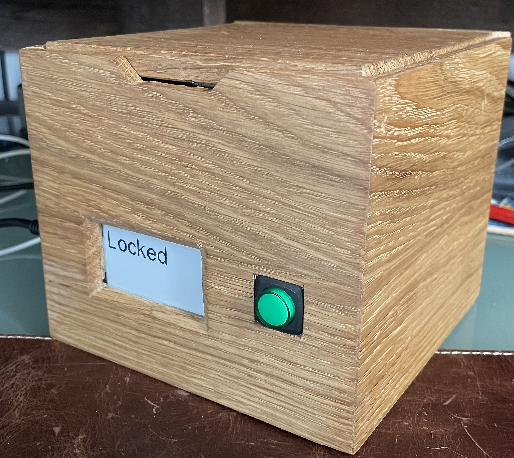
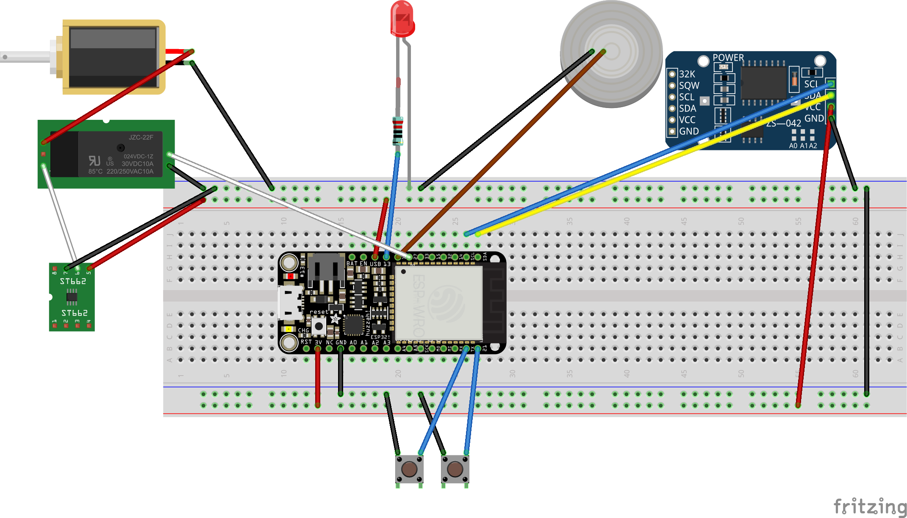

# LockBox
A software for creating a remotely controlled LockBox using ESP32, a solenoid lock and other sensors.

Now with Chaster.app integration

Fot this project I used:
 * Adafruit Huzzah32
 * Adafruit monochrome epaper display feather wing
 * 12v solenoid lock (you may use the 5v version available on Adafuit shop but will need modifications in the code or on the lock)
 * 5v to 12v converter (if using 12v lock)
 * DS3231 RTC module from AliExpress
 * Simple Relay
 * End of travel sensor or something similar or button (I used a button with integrates spring salvaged from an old device)
 * Push button
 * A LED (integrated in the button in my case)

## Build
 * Copy the file lockbox.h.dist to lockbox.h and set your wifi credentials
 * Compile and upload the code using Arduino IDE
 * Upload the web file to the ESP32 using the method described here  
   * ~~(Arduino IDE 1.8 needed): https://randomnerdtutorials.com/install-esp32-filesystem-uploader-arduino-ide/~~
   * using platform.io: https://randomnerdtutorials.com/esp32-vs-code-platformio-spiffs/
     1. Click the PIO icon at the left side bar. The project tasks should open.
     2. Select env:esp32doit-devkit-v1 (it may be slightly different depending on the board you’re using).
     3. Expand the Platform menu.
     4. Select Build Filesystem Image.
     5. Finally, click Upload Filesystem Image.
     * Important: to upload the filesystem image successfully you must close all serial
connections (Serial Monitor) with your board.
 * Have fun

## Schema
Here you can find an example of a schema for this. 

The e-paper display is not represented, and the component may not be accurate.

NOTE: Using the 5v to 12v converter requires a 3A power supply, you may want to power it using 12v and have a 12v to 5v converter for the Microcontroller

---

# 2023-oct McSwitchy fork notes
forked from https://github.com/drone4770/LockBox

my thread on chaster discord
https://discord.com/channels/710587363918741604/1137497594973671524/1162164560317382727

chaster api reference:
https://api.chaster.app/api#/

api docs: 
https://docs.chaster.app/api/extensions-api/authentication

chaster dev backlog:
https://trello.com/b/7YdrTGI1/chaster-backlog

pretty sure the codebase isn't using the extension api yet (extension endpoints all include `/api/extensions` but don't see this anywhere in src files)

devs conversation in chaster discord developer channel re auth
https://discord.com/channels/710587363918741604/815286351070756905/1140341946871713872

## get api access and create app
- apply for api access, public
- create new application https://chaster.app/developers/applications/
  - name: Drone4770LockBox
  - redirect URI: http://lockbox.local/callback